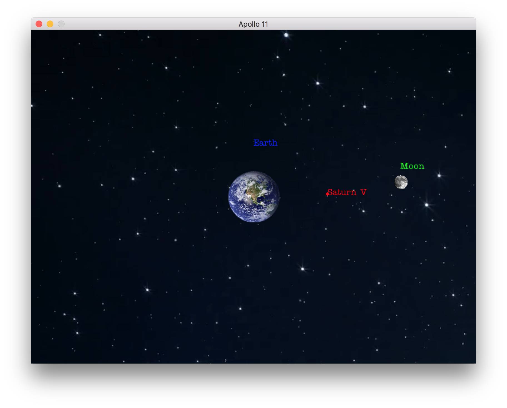

# Apollo11

## 1 Zielsetzung & Motivation

Unser Ziel ist es mit *Tkinter* und *PyGame* ein Programm zu schreiben, dass eine Mondlandung simulieren kann. Bei dieser Simulation soll das Raumschiff zuerst zum Mond geschickt und in dessen Umlaufbahn parkiert werden . Anschliessend soll eine Landefähre ausgeschickt werden, die mit der Hilfe eines Antriebes sanft auf dem Mond landet.  
Der Grund wieso wir dieses eher anspruchsvolle Projekt gewählt haben, ist zum Einem, weil wir von Herr Kambor dazu motiviert wurden zum Anderen, weil uns die Mondlandung fasziniert. Ausserdem haben wir uns gefragt, welche physikalischen Gesetze man bei einer vereinfachten Raumfahrtsimulation zum Mond beachten muss.

## 2 Unser Weg

Unser erster Schritt bei dem neuen Projekt war es, uns eine Übersicht über unsere Aufgabenstellung zu verschaffen. Dabei hat uns das Dokument *Simulation von Bewegung Anregung zur Arbeitstechnik* geholfen und wir haben im folgenden Punkt aufgelistet, welche Teilaufgaben es zu bewältigen gilt, um die Simulation sinngemäss darzustellen.  
Es braucht:
* Anfangswerte und Konstanten
* Ein Runge-Kutta-Verfahren für das Lösen der Differenzialgleichung, damit man die Position und die folgende Position des Mondes und der Rakete annäherungsweise berechnen kann
* Differenzialgleichung für das Zweikörperproblem
* Kollisionserkennung
* Eine passende Geschwindigkeit der Rakete, damit diese aus der Umlaufbahn um die Erde entweichen kann und dann anschliessend auf der Umlaufbahn um den Mond «geparkt» werden kann.
* Eine passende Schubkraft, damit die Landefähre sanft auf der Oberfläche des Mondes landen kann
* Ein in *Tkinter* eingebettetes *PyGame-Fenster*

### 2.1 Anfangswerte und Konstanten
Eine weitere Aufgabe war es die Anfangswerte und Konstanten, die in unserer Simulation benötigt werden, zu recherchieren und zu berechnen. Als Bespiel kann man die Erd- oder die Mondmasse nennen. Diese Werte sind von Nöten, um die Differenzialgleichungen für das Zweikörperproblem aufzustellen und zu lösen.

### 2.2 Das Runge-Kutta-Verfahren
Als nächstes haben wir das Runge-Kutta-Verfahren zweiter Ordnung programmiert. Dabei gab es vor Allem am Anfang Schwierigkeiten, das zweistufige Verfahren, welches bei unserer Simulation für die Fortbewegung von Mond und der Rakete *Saturn V* in Relation zu der Erde von Nöten ist, richtig zu verstehen. 

### 2.3 Das Zweikörperproblem
Mit den zuvor gesammelten Daten können wir die korrekte Bahn des Mondes um die Erde, die von den Gravitationskräften beeinflusst wird, berechnen. Bei unserer Berechnung haben wir definiert, dass sich die Erde im Mittelpunkt bei den Koordinaten (0/0) befindet. Die Gravitationskräfte der Erde und des Mondes, die sich auf *Saturn V* auswirken, kann man praktisch auf dieselbe Art berechnen. Dabei gab es zu Beginn jedoch ein kleines Problem, denn die Rakete stiess sich aufgrund eines Vorzeichenfehlers immer von den Objekten ab, anstatt von ihnen angezogen zu werden. Für die Schubkraft, die einen Einfluss auf die Rakete hat, wird anhand eines Vektors berechnet beziehungsweise sie fliegt in die Richtung des vorgegebenen Vektors. 
$$
r'' = -G\frac{mM}{r^2} \cdot \frac{1}{\mu} \cdot \frac{\vec{r}}{r}
$$

### 2.4 Skalierung 
Damit grafisch alles Korrekt, das heisst alles in der richtigen oder in der gewollten Grösse, dargestellt wird, ist es notwendig, dass die Objekte Erde und Mond abhängig von der Grösse des Projektions-Rechtecks, auf dem sich unsere Animation abspielt, zu machen. 

### 2.5 Kollisionserkennung
Ein weiterer Aspekt war es, Kollisionen zu erkennen bzw. heraus zu finden, wann die Rakete "auf der Erde ist" und sich nicht einfach "in die Erde" oder "durch den Mond" bewegt. Das Problem haben wir so gelöst, indem wir die Distanz zwischen einem Punkt der Rakete und dem Mittelpunkt des Mondes oder der Erde berechnet haben und dieser sollte immer grösser als der Radius des jeweiligen Himmelskörpers sein.

## 3 Aktueller Stand

Wir haben wie oben im Bild ersichtlich eine Erde einen Mond und eine Rakete *Saturn V*. Der Mond wird von der Gravitationskraft der Erde beeinflusst und er bewegt sich auf einer leicht ellipsischen Bahn um sie. Für die Berechnung der Positionen des Mondes hat es ein funktionierendes Runge-Kutta-Verfahren zweiter Ordnung. *Saturn V* wird wie der Mond von der Gravitationskraft der Erde aber auch noch von der Gravitationskraft des Mondes beeinflusst. Für die Berechnung der Position kann die selbe Runge-Kutta-Funktion verwendet werden. Die Richtung der Rakete ist dank eines Vektors, der die Schubkraft darstellen soll, lenkbar. Das Landemodul kann von der Rakete losgelöst werden und wird genau wie die Rakete von den beiden Gravitationskräften beeinflusst. 

## 4 Ausblick
Was bei unserer Simulation noch fehlt ist die Berechnung für die Schubkraft von *Saturn V*, damit sie zuerst die Umlaufbahn um die Erde verlassen und anschliessen auf der Umlaufbahn des Mondes «parkiert» werden kann. Für diese Herausforderung haben wir uns schon einen möglichen Lösungansatz überlegt, der wie folgt aussieht: Mit der Hilfe eines *PID-Feedbackcontrollers* soll eine Zielposition/Zwischenposition und eine Geschwindikeit, die die Rakete im Ziel haben soll, für diese vorgegeben werden. Der Controller sorgt dafür, dass die Schubkraft laufend so berechnet wird, dass die Rakete, ohne das Ziel zu verfehlen, am vorgegebenen Ort ankommt.
Die Schubkraft des Landemoduls *Eagle* für eine sanfte Landung muss auch noch berechnet werden. Aber das Prinzip der Landung wird gleich wie bei dem Flug der Rakete sein.  
 
  
 
Elegant wäre es auch noch, wenn wir, wie wir es uns vorgenommen haben, eine Bedienungsoberfläche mit *Tkinter* einbringen können. Diese Bedienungsoberfläche soll zwei Knöpfe haben, mit denen man die Simulation starten als auch stoppen und zurück an den Anfang setzen kann. Weitere Funktionen, die die Simulation haben sollte, wäre zum Beispiel eine Zoomfunktion.

